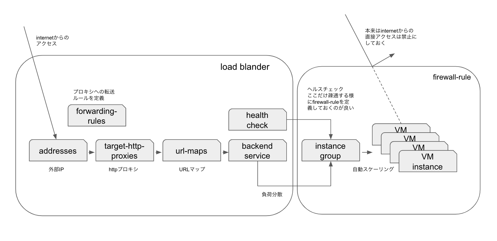
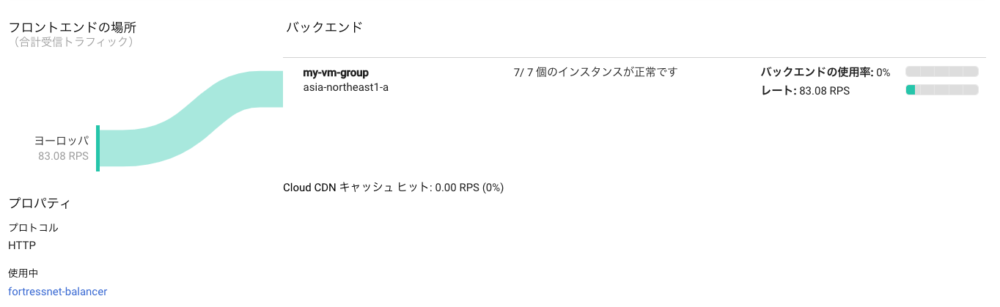
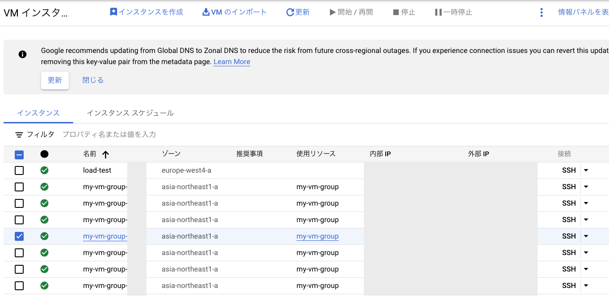

# GCEで自動スケーリングを実現する
2021/04/29

## やりたいこと
1. インスタンステンプレートを作成する
2. インスタンステンプレートを利用して、マネージドインスタンスグループを作成する
3. httpロードバランサーを設定する
4. 負荷テストを実施して、インスタンスが自動スケーリングすることを確認する

上記をなるべくコマンドで実行していきます。

## 1. インスタンステンプレートを作成する
基本のコマンドに必要なオプションをつけて実行する。

apacheのインストール時にバージョンを明記するのが実用的
```
gcloud compute instance-templates create template-my-web-server \
    --image-family debian-10 \
    --image-project debian-cloud \
    --tags http-server \
    --machine-type f1-micro \
    --metadata startup-script='#! /bin/bash 
    sudo apt update
    sudo apt -y install apache2=2.4.38-3+deb10u4'
```

下記、正しくないかもしれないが、debianの使い方
```
- パッケージのインストール状況の確認
    - `dpkg -L <pachagename>`

- 利用可能なバージョンの確認
    - `apt-cache showpkg <pachagename>`
```


createコマンドの結果をリストして確認
```
gcloud compute instance-templates list

NAME                    MACHINE_TYPE   PREEMPTIBLE  CREATION_TIMESTAMP
template-my-web-server  f1-micro                    yyyy-mm-ddT03:51:48.531-07:00
```

## 2. インスタンステンプレートを利用して、マネージドインスタンスグループを作成する

マネージドインスタンスグループの作成コマンド
```bash
gcloud compute instance-groups managed create my-vm-group \
    --size 2 \
    --template template-my-web-server \
    --zone asia-northeast1-a
```
パラメタ | 意味　　
-----|---
--size | グループの初期インスタンス数。整数を指定。今回は2
--template | 使用するテンプレート 
--zone | デフォルトから変更がなければ指定は不要?

作成結果の確認
```
gcloud compute instance-groups list

NAME         LOCATION           SCOPE  NETWORK  MANAGED  INSTANCES
my-vm-group  asia-northeast1-a  zone   default  Yes      0
```

インスタンスの確認、インスタンスグループを作成と同時にインスタンスが起動している。
```
gcloud compute instances list


NAME              ZONE               MACHINE_TYPE  PREEMPTIBLE  INTERNAL_IP    EXTERNAL_IP    STATUS
my-vm-group-xxx1  asia-northeast1-a  f1-micro                   [INTERNAL_IP]  [EXTERNAL_IP]  RUNNING
my-vm-group-xxx2  asia-northeast1-a  f1-micro                   [INTERNAL_IP]  [EXTERNAL_IP]  RUNNING
```

webサーバーの動作確認、返答があればOK
```
curl [EXTERNAL_IP]@my-vm-group-xxx1
curl [EXTERNAL_IP]@my-vm-group-xxx2
```

上記でマネージドインスタンスグループが構成出来た。

## 3. httpロードバランサーを設定する
まずは、マネージドインスタンスグループに対して、http負荷分散の処理能力に応じてスケーリングする様に設定する。
```
gcloud compute instance-groups managed set-autoscaling my-vm-group \
    --max-num-replicas 7 \
    --target-load-balancing-utilization 0.6

Created [https://[MY_ZONE]/autoscalers/my-vm-group-xxxx].
---
autoscalingPolicy:
  coolDownPeriodSec: 60
  loadBalancingUtilization:
    utilizationTarget: 0.6
  maxNumReplicas: 7
  minNumReplicas: 2
  mode: ON
creationTimestamp: 'yyyy-mm-ddT05:59:25.345-07:00'
id: 'xxxxxxxxxxxxx'
kind: compute#autoscaler
name: my-vm-group-j7oy
selfLink: https://[MY_ZONE]/autoscalers/my-vm-group-xxxx
status: ACTIVE
target: https://[MY_ZONE]/instanceGroupManagers/my-vm-group
zone: https://[MY_ZONE]
```

ヘルスcheckの構成
```
gcloud compute health-checks create http http-basic-check

Created [https://www.googleapis.com/compute/v1/projects/hoo/global/healthChecks/http-basic-check].
NAME              PROTOCOL
http-basic-check  HTTP
```

バックエンドサービスの構成
```
gcloud compute backend-services create fortressnet-backend-service \
    --protocol HTTP \
    --health-checks http-basic-check \
    --global

Created [https://www.googleapis.com/compute/v1/projects/hoo/global/backendServices/fortressnet-backend-service].
NAME                         BACKENDS  PROTOCOL
fortressnet-backend-service            HTTP
```

作成したバックエンドサービスにバックエンド(ここではインスタンスグループ)を追加
```
gcloud compute backend-services add-backend fortressnet-backend-service \
    --balancing-mode RATE \
    --max-rate-per-instance 100 \
    --instance-group my-vm-group \
    --instance-group-zone asia-northeast1-a \
    --global

Updated [https://www.googleapis.com/compute/v1/projects/hoo/global/backendServices/fortressnet-backend-service].
```

URL マップを定義
```
gcloud compute url-maps create fortressnet-balancer \
    --default-service fortressnet-backend-service
Created [https://www.googleapis.com/compute/v1/projects/hoo/global/urlMaps/fortressnet-balancer].

NAME                  DEFAULT_SERVICE
fortressnet-balancer  backendServices/fortressnet-backend-service
```

HTTP プロキシルートを定義
```
gcloud compute target-http-proxies create fortressnet-http-proxy \
    --url-map fortressnet-balancer
```

フロントエンドの構成
```bash
# ロードバランサーにIPv4を構成
gcloud compute addresses create fortressnet-ip \
    --ip-version IPV4 \
    --global

# ロードバランサーにIPv6を構成
gcloud compute addresses create fortressnet-ipv6 \
    --ip-version IPV6 \
    --global

# ロードバランサーの外部IPを確認
gcloud compute addresses list

# プロキシに転送するルールを作成
gcloud compute forwarding-rules create fortressnet-http-rule \
    --global \
    --target-http-proxy fortressnet-http-proxy \
    --ports 80 \
    --address 34.117.112.97

gcloud compute forwarding-rules create fortressnet-http-ipv6-rule \
    --global \
    --target-http-proxy fortressnet-http-proxy \
    --ports 80 \
    --address 2600:1901:0:8b8::
```

ここまでの全体像
(ヘルスチェックの向き先がまだ良く理解できていない。概ねこの様な形と思われる。)



俯瞰してみると、ロードバランサーは種々の負荷分散系のコンポーネントの組み合わせの様だ。
GCPコンソールで設定を行う場合は、gcloudコマンドよりも上記の構成がイメージしやすいようなUIになっていると感じた。

## 4. 負荷テストを実施して、インスタンスが自動スケーリングすることを確認する
[siege](https://github.com/JoeDog/siege)をインストールしたインスタンスを作成する。ここからリクエストを発生させる。
```
gcloud compute instances create europe-loadtest \
    --network default \
    --zone europe-west1-c \
    --metadata startup-script='apt -y install siege'
```

サーバーにログインしテスト開始
```bash
# VMにsshでログイン
gcloud compute ssh load-test --zone europe-west4-a 

# siegeでアクセスする
# `-c`は同時接続数を指定するオプション。
siege -c150 http://EXTERNAL_IPv4@Loadbalancer
```

GCPコンソールで確認すると、自動スケールすることが確認された。
VMが設定した通りに7個まで増えている。




`siege`を終了して暫くすると、インスタンスが減っていることも確認できます。
デフォルトの2つまで減少していました。


以上で、GCEで自動スケーリングの構築することが出来ました。
スケール時の変数など詳細について徐々に理解していきたいと思います。

## 公式doc

#### 1. インスタンステンプレートを作成する
* [既存のインスタンスに基づくインスタンス テンプレートの作成](https://cloud.google.com/compute/docs/instance-templates/create-instance-templates?hl=ja#based-on-existing-instance)

#### 2. インスタンステンプレートを利用して、マネージドインスタンスグループを作成する
* [マネージド インスタンス グループの作成](https://cloud.google.com/compute/docs/instance-groups/creating-groups-of-managed-instances?hl=ja)


#### 3. httpロードバランサーを設定する
* [Compute Engine でのウェブサービスのグローバルな自動スケーリング](https://cloud.google.com/compute/docs/tutorials/globally-autoscaling-a-web-service-on-compute-engine?hl=ja#gcloud)

#### 4. 負荷テストを実施して、インスタンスが自動スケーリングすることを確認する
* [インスタンスのグループの自動スケーリング](https://cloud.google.com/compute/docs/autoscaler?hl=ja)
* [負荷分散処理能力に基づくスケーリング](https://cloud.google.com/compute/docs/autoscaler/scaling-load-balancing?hl=ja)
* [Compute Engine でのウェブサービスのグローバルな自動スケーリング](https://cloud.google.com/compute/docs/tutorials/globally-autoscaling-a-web-service-on-compute-engine?hl=ja#gcloud)

