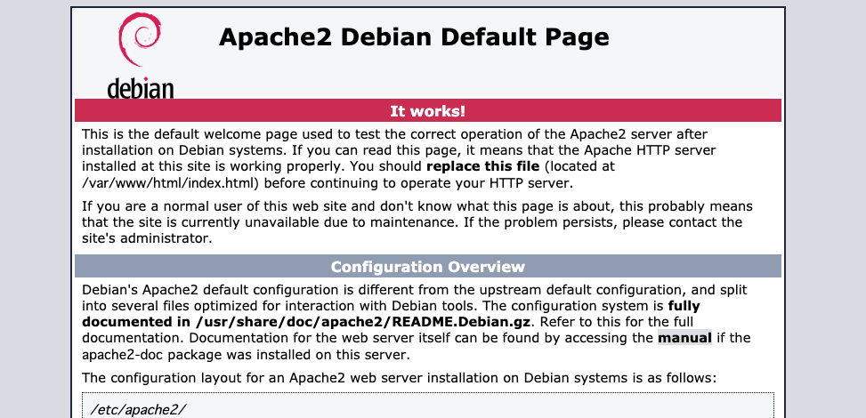

# GCEで自動スケーリングを実現する
2021/04/29

## やりたいこと
1. VMインスタンスを作成しwebサーバをたてる
2. VMインスタンスからインスタンステンプレートを作成する
3. インスタンステンプレートからマネージドインスタンスグループを作成する
4. httpロードバランサーを設定する
5. 負荷テストを実施して、インスタンスが自動スケーリングすることを確認する

上記をなるべくコマンドで実行していく。

## 1. VMインスタンスを作成しwebサーバをたてる  

インスタンスを作成する基本のコマンドは下記。
種々のオプションを色々つけていくことで、目的に合致したインスタンスを作成出来る。
```
gcloud compute instances create [INSTANCE-NAME]
```

今回の下記の要件を満たすようにオプションの内容を検討する。
* 費用を抑えて構成する
* インスタンスへのhttpアクセスを可能にする


### 費用を抑えて構成する
#### イメージの検索
インスタンスに利用可能なイメージのリスト
```
gcloud compute images list 
```
distributionはdebianにしました。

#### マシンタイプの検索
下記コマンドでマシンタイプ表示させてみる。f1が安かったはず。
```
gcloud compute machine-types list --filter="NAME~f1*" 
```

`NAME~f1*`は`NAME like f1*`の意味

### インスタンスへのhttpアクセスを可能にする
#### ファイアーウォール
httpアクセスを許可したいので、firewallを適用したい。現在のルールをリストしてみる。
```
gcloud compute firewall-rules list
```

httpアクセスに関するルールがなかったので作成
```
gcloud compute firewall-rules create allow-http \
--allow tcp:80

gcloud compute firewall-rules create allow-https \
--allow tcp:443
```

ルールにtagをつける。
```
gcloud compute firewall-rules update allow-http --target-tags allow-http
```
※tag付けしないと、全てのリソースにルールが適用される。tagをつけることで、特定のインスタンスだけに適用するルールを作成できる。


作成したtagsを`--tags`オプションでインスタンス作成時に指定する

#### 外部IPアドレス
`gcloud compute instances create`実行時に、自動でエフェメラル外部 IP アドレスが付与される


### 最終的に指定した完成したコマンド
この様にしました。tag付けの概念が少し難しかったです。
```
gcloud compute instances create my-web-server \
--image-family debian-10 \
--image-project debian-cloud \
--machine-type f1-micro \
--tags allow-http,allow-https \
```

GCPコンソールで確認すると下記にcheckが入っていないが、アクセスは出来る模様


(可能ならGCPコンソールの表示と同期させてほしいですね。)

#### webサーバーを構築する。
vmのリストを表示
```
gcloud compute instances list
```

vmにssh
```
gcloud compute ssh my-web-server
```

apacheをインストール
```
sudo apt update && sudo apt -y install apache2
```

ローカルからcurlでアクセスを確認
```
curl 'http://IP-ADDRESS'
```

ブラウザからアクセスする場合は、下記が表示されればOK



補足：gloudコマンドの使い方は`--help`で確認できる

## 2. VMインスタンスからインスタンステンプレートを作成する
基本のコマンド。実行する際に、インスタンスの定義をオーバーライド出来るらしい。今回はそのまま作成する。
```
gcloud compute instance-templates create [INSTANCE_TEMPLATE_NAME] \
    --source-instance=[SOURCE_INSTANCE] \
    --source-instance-zone=[SOURCE_INSTANCE_ZONE] \
```

結果をリストして確認
```
gcloud compute instance-templates list
```

## 3. インスタンステンプレートからマネージドインスタンスグループを作成する
```bash
gcloud compute instance-groups managed create INSTANCE_GROUP_NAME \
    --size SIZE \
    --template INSTANCE_TEMPLATE \
    --zone ZONE
```

gcloud compute instance-groups managed create my- \
    --size  \
    --template  \
    --zone 

## 4. httpロードバランサーを設定する
## 5. 負荷テストを実施して、インスタンスが自動スケーリングすることを確認する


## 公式doc
#### 1. VMインスタンスを作成しwebサーバをたてる
[基本的な Apache ウェブサーバーの実行](https://cloud.google.com/compute/docs/tutorials/basic-webserver-apache?hl=ja)

#### 2. VMインスタンスからインスタンステンプレートを作成する
[既存のインスタンスに基づくインスタンス テンプレートの作成](https://cloud.google.com/compute/docs/instance-templates/create-instance-templates?hl=ja#based-on-existing-instance)

#### 3. インスタンステンプレートからマネージドインスタンスグループを作成する
[マネージド インスタンス グループの作成](https://cloud.google.com/compute/docs/instance-groups/creating-groups-of-managed-instances?hl=ja)


#### 4. httpロードバランサーを設定する
#### 5. 負荷テストを実施して、インスタンスが自動スケーリングすることを確認する
* [インスタンスのグループの自動スケーリング](https://cloud.google.com/compute/docs/autoscaler?hl=ja)