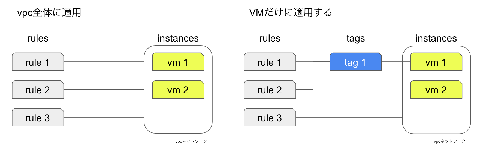

# GCE@GCPでwebサーバーをたてる

GCEでwebサーバーをたてる方法。
gcloudコマンドで行う方法を記載しています。

## VMインスタンスを作成しwebサーバをたてる  

インスタンスを作成する基本のコマンドは下記。
種々のオプションを色々つけていくことで、目的に合致したインスタンスを作成出来る。
```
gcloud compute instances create [INSTANCE-NAME]
```

今回の下記の要件を満たすようにオプションの内容を検討する。
* 費用を抑えて構成する
* インスタンスへのhttpアクセスを可能にする

### 費用を抑えて構成する
#### イメージの検索
インスタンスに利用可能なイメージのリスト
```
gcloud compute images list 

NAME                                                  PROJECT              FAMILY                            DEPRECATED  STATUS
centos-7-v20210420                                    centos-cloud         centos-7                                      READY
centos-8-v20210420                                    centos-cloud         centos-8                                      READY
centos-stream-8-v20210420                             centos-cloud         centos-stream-8                               READY

and more
```
上記の内、使用するPROJECT、FAMILYをメモしておく。
distributionはdebianにしました。

#### マシンタイプの検索
下記コマンドでマシンタイプ表示させてみる。f1が安かったはず。
```
# `NAME~f1*`は`NAME like f1*`の意味
gcloud compute machine-types list --filter="NAME~f1*" 

NAME      ZONE                       CPUS  MEMORY_GB  DEPRECATED
f1-micro  us-central1-a              1     0.60
f1-micro  us-central1-b              1     0.60
f1-micro  us-central1-c              1     0.60
f1-micro  us-central1-f              1     0.60
f1-micro  us-central1-d              1     0.60

and more
```
上記の内、インスタンスを構築するリージョンにf1-microが存在していることを確認する。

### インスタンスへのhttpアクセスを可能にする
#### ファイアーウォール
httpアクセスを許可したいので、firewallを適用したい。現在のルールをリストしてみる。
```
gcloud compute firewall-rules list

NAME                    NETWORK  DIRECTION  PRIORITY  ALLOW                         DENY  DISABLED
default-allow-icmp      default  INGRESS    65534     icmp                                False
default-allow-internal  default  INGRESS    65534     tcp:0-65535,udp:0-65535,icmp        False
default-allow-rdp       default  INGRESS    65534     tcp:3389                            False
default-allow-ssh       default  INGRESS    65534     tcp:22                              False
```

httpアクセスに関するルールがなかったので作成
```
gcloud compute firewall-rules create allow-http \
--allow tcp:80

gcloud compute firewall-rules create allow-https \
--allow tcp:443
```

ルールにtagをつける。
```
gcloud compute firewall-rules update allow-http --target-tags allow-http
```
※tag付けしないと、全てのリソースにルールが適用される。tagをつけることで、特定のインスタンスだけに適用するルールを作成できる。



作成したtagsを`--tags`オプションでインスタンス作成時に指定する

#### 外部IPアドレス
`gcloud compute instances create`実行時に、自動でエフェメラル外部 IP アドレスが付与される


### 最終的に指定した完成したコマンド
この様にしました。tag付けの概念が少し難しかったです。
```
gcloud compute instances create my-web-server \
--image-family debian-10 \
--image-project debian-cloud \
--machine-type f1-micro \
--tags allow-http,allow-https \
```

GCPコンソールで確認すると下記にcheckが入っていないが、アクセスは出来る模様


(可能ならGCPコンソールの表示と同期させてほしいですね。)

#### webサーバーを構築する。
vmのリストを表示
```
gcloud compute instances list

NAME            ZONE               MACHINE_TYPE  PREEMPTIBLE  INTERNAL_IP  EXTERNAL_IP  STATUS
my-web-server   asia-northeast1-a  f1-micro                   10.146.0.61               TERMINATED
my-web-server2  asia-northeast1-a  f1-micro                   10.146.0.62               TERMINATED
```

vmにssh　初めてのsshするときは、keyの生成とパスワードの設定が求められます。
```
gcloud compute ssh my-web-server
```

apacheをインストール
```
sudo apt update && sudo apt -y install apache2
```

ローカルからcurlでアクセスを確認
```
curl 'http://IP-ADDRESS'
```

下記、正しくないかもしれないが、debianの使い方
- パッケージのインストール状況の確認
    - `dpkg -L <pachagename>`

- 利用可能なバージョンの確認
    - `apt-cache showpkg <pachagename>`


ブラウザからアクセスする場合は、下記が表示されればOK


補足：gloudコマンドの使い方は`--help`で確認できます。

### VMインスタンスからインスタンステンプレートを作成する際の注意点
この記事では詳細の記載はないが、VMインスタンスからインスタンスのテンプレートを作成することが出来る。下記の注意点があるので注意。

* 既存のVMインスタンスをテンプレート化するユースケース以外では、直接テンプレートを作成した方が良い。
    * インスタンスにインストールされたアプリケーションをテンプレート化できるわけではない。     
    * [machine typeとlabelsはオーバライド出来るが、それ以外は指定してもソースにしたインスタンスのものが有効になってしまう](https://cloud.google.com/sdk/gcloud/reference/compute/instance-templates/create?hl=ja#--source-instance)ので注意する。
    (**`--metadata startup-script`でインストール内容を記載でき、エラーなくコマンド終了するが、内部的には無視されている。**
)
    * エフェメラルIPを使用している場合、IPアドレスがそのままテンプレート化されると都合が悪いので注意する。テンプレート作成時に、`--no-address`オプションを指定することで回避できる。(と思う。)


## 公式doc
#### 1. VMインスタンスを作成しwebサーバをたてる
[基本的な Apache ウェブサーバーの実行](https://cloud.google.com/compute/docs/tutorials/basic-webserver-apache?hl=ja)

