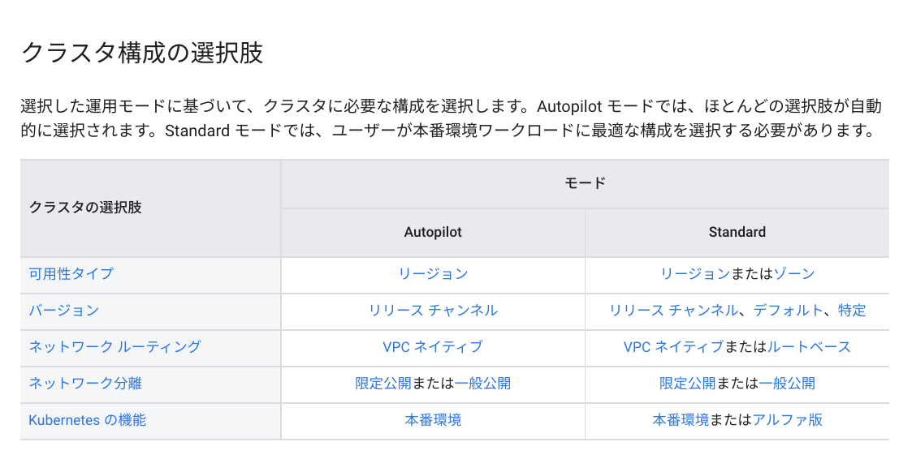
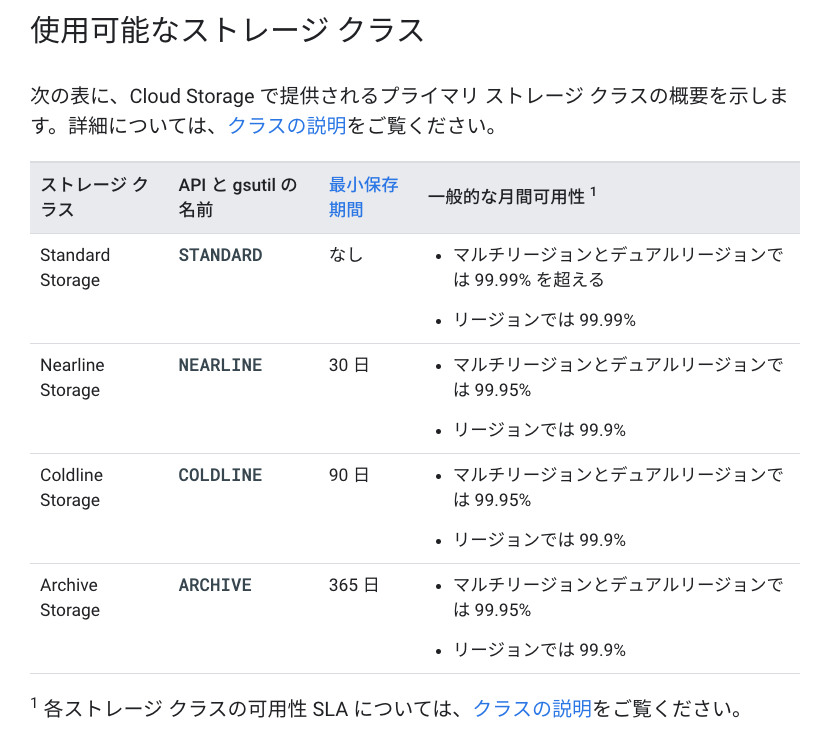

## k8s
- Secret
base64でエンコードされて、機密性の高い情報を安全にクラスタに格納できる。

## 本番環境での Google Kubernetes Engine の準備
https://cloud.google.com/architecture/prep-kubernetes-engine-for-prod

  

### マルチゾーンクラスタ・リージョンクラスタ

リージョンクラスタが高稼働率を保証されている。

- マルチゾーンクラスタ
  - 1 つのゾーンに単一のクラスタ マスターを作成します。
  - 複数のゾーンにノードを作成します。

- リージョンクラスタ
  - 3 つのゾーンに 3 つのクラスタ マスターを作成します。
  - デフォルトでは 3 つのゾーンにノードを作成しますが、必要に応じて、必要な数のゾーンにノードを作成できます。
限定公開クラスタ

### 限定公開クラスタ
デフォルトでは、GKE クラスタ内のすべてのノードにパブリック IP アドレスが割り振られるが、
限定公開クラスタでは、すべてのワーカーノードにプライベート RFC 1918 の IP アドレスのみを付与する。

外向きにはCloudNATを使ったりする。

### Autopilot クラスタ
Autopilot モードは、Service とアプリケーションに集中できる一方、ノードの管理とインフラストラクチャの管理は Google が行う、人による操作が不要な Kubernetes 環境です。

### GKE のオートスケール 5種類
https://tech.quickguard.jp/posts/gke-autoscale-overview/

- 水平：Podの数増やす
- 垂直：Podのスペック上げる
- クラスタオートスケーラー(CA)：ノードの数増やす
- ノード自動プロビジョニング(NAP)：ノードの数増やす

コンテナ イメージ リポジトリを閲覧し、コンテナ イメージの詳細を見る

## VPC
カスタムルート：ネットワークの経路を示した情報

とりあえず以下の用語の関係性を理解しておく。
- 組織内：共有VPC
- 組織外：VPCピアリング：`カスタムルートのインポート・エクスポート`(ピアリングしたVPCでルート情報のやり取り)
- Cloud Router：`ルート アドバタイズ`(オンプレミスにVPCのサブネットの情報を広告する。)

- VPC Network : Global resource
- VPC SubNetwork : region resource

## Cloud Router
BGP(Border Gateway Protocol)
https://www.nic.ad.jp/ja/basics/terms/bgp.html

Cloud VPN トンネルを使用してネットワークを接続する場合、Cloud Router を使用して、オンプレミス ルーターとの間で BGP セッションを確立できます。Cloud Router は、VPC ネットワーク内の新しいサブネットを自動的に学習し、オンプレミス ネットワークに通知します。

### VPCピアリング
同じプロジェクトまたは組織に属しているかどうかに関わらず、２つの Virtual Private Cloud（VPC）ネットワーク間でプライベート RFC1918接続を確立できます

> - ネットワーク レイテンシ: 内部アドレスのみを使用する接続は、外部アドレスを使用する接続よりもレイテンシが低くなります。
> - ネットワークのセキュリティ: サービス オーナーは、サービスをインターネットに公開して関連するリスクに対処する必要がありません。
> - ネットワークのコスト: Google Cloud では、同じゾーン内のトラフィックであっても、外部 IP を使用して通信するネットワークに対して下り（外向き）帯域幅の料金が発生します。ただし、ネットワークがピアリングされている場合、内部 IP を使用して通信することで、このような下り（外向き）のコストを節約できます。この場合でも、通常のネットワーク料金はすべてのトラフィックに適用されます。

### 共有VPC
共有 VPC は、同じ組織内の複数のプロジェクトから共通のVPCネットワークにリソースを接続できるサービスです。

## VPC Service 
https://cloud.google.com/vpc-service-controls/docs/overview?hl=ja

## GCS

今更下記
- スタンダード：なし
- ニアライン：30
- コールド：90
- アーカイブ：365

スニッカーの30倍(?)で覚える

## GCE

### インスタンスのサービス アカウントの作成と有効化

インスタンスアクセススコープ：インスタンスがアクセスできる範囲
➝インスタンスレベルでスコープを定義できる。

ただし、サービス アカウントを VM インスタンスに接続する際にアクセス スコープに依存させず、サービスアカウントのIAMできめ細かい管理するのがベストな方法
> 通常は、cloud-platform アクセス スコープを設定してほとんどの Cloud APIs に対するアクセスを許可してから、関連する IAM ロールのみをサービス アカウントに付与できます。

GPU を新しいインスタンスに接続し、CUDA ライブラリをインストールする
現在実行されている VM のインベントリ（インスタンス ID、詳細）を見る

## Cloud DNS

モニタリングとロギング用に Stackdriver Agent をインストールする