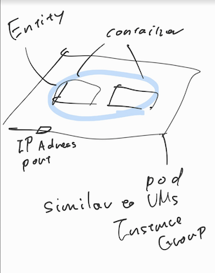
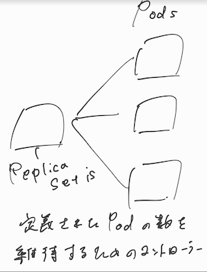

## 共有VPC、VPCピアリングの違い

### それぞれの特徴
* [共有VPC](https://cloud.google.com/vpc/docs/shared-vpc)
  * 共有 VPC は、同じ組織内のプロジェクトに接続します。
  * ホスト プロジェクトとサービス プロジェクトが存在する。プロジェクト レベルのアタッチメントで接続する。
  * 共有するサブネットを個別に指定することも出来る。
* [VPCピアリングの概要](https://cloud.google.com/vpc/docs/vpc-peering)
  * Google Cloud VPC ネットワーク ピアリングでは、2 つの Virtual Private Cloud（VPC）ネットワークが同じプロジェクトまたは同じ組織に属しているかにかかわらず、内部 IP アドレス接続できる。
  * 内部IPを使用するとレイテンシ、セキュリティ、コストの面で外部IP、VPNよりも優れている。
  * VPC ネットワーク ピアリングは、Compute Engine、GKE、App Engine フレキシブル環境で動作します。

### 上記見比べて主な違い
* 組織が違う場合はVPCピアリング一択
* VPCピアリングは管理のオーバーヘッドも無視できないので、可能なら共有VPCが好ましい。
* サブネットの重複などを意識する必要があるので、途中からピアリングするのは難しいかも

[参考記事](https://medium.com/google-cloud-jp/gcp-%E3%81%AE%E7%B4%B0%E3%81%8B%E3%81%99%E3%81%8E%E3%81%A6%E4%BC%9D%E3%82%8F%E3%82%89%E3%81%AA%E3%81%84%E3%83%8F%E3%82%A4%E3%83%96%E3%83%AA%E3%83%83%E3%83%89%E3%83%8D%E3%83%83%E3%83%88%E3%83%AF%E3%83%BC%E3%82%AD%E3%83%B3%E3%82%B0-14ed12ebe84d)

> なお、GCP では基本的にはあまり多くの VPC は作成せず、**Shared VPC を活用することで少数の中央集権的な VPCでシステムを構成する方法をお勧め**しています。なので「VPC がたくさんできちゃったから VPN でつなご！」という場合、なんでたくさんできちゃったかを考えてみましょう。

## 組織階層のモデル

  

## ローカルSSD、永続ディスクの違い

  
> どのオプションを使用すればよいかわからない場合、最も一般的なのは、インスタンスに永続ディスクを追加するソリューションです。

#### 永続ディスク
  

#### ロ-カルSSD
  

### 上記見比べて主な違い
ローカルSSDはVMが落ちるとデータが消失する可能性がある
→特に低レイテンシなCRUDが発生する場合に必要なオプション。基本的には永続ディスクを使用する。

永続ディスクの中ではゾーン、リージョン、HDD、SSDと別れているので、可用性、予算に合わせて適切なリソースを選択する。

## Cloud Amorのルール作成方法について
> Google Cloud Armor のセキュリティ ポリシーを使用して、ロードバランサの背後で実行されているアプリケーションを分散型サービス拒否攻撃（DDoS）やその他のウェブベースの攻撃から保護します。
LBのオプションとして設定出来るサービス

該当するgcloudコマンドは[`gcloud compute security-policies`](https://cloud.google.com/sdk/gcloud/reference/compute/security-policies)

## k8sのリージョンクラスタ、ゾーンクラスタの違い
## Spannerのアーキ基礎、なぜ主キーはインクリメンタルな数字では良くないのか
## Bigtableの可用性の設計方法
## VPCのサブネットの考え方
## BigQuery Data TransferServiceの概要を把握
## ストレージの設計おさらい
## k8s Object
### Pod

  

### Serive
  

### ReplicaSet
  

### Deployment
  

### StatfulSet
  

### job
ワークロードの抽象化
使用するコンテナと実行するコマンドが構成ファイルに記述されている。

## k8sのスケーリング設定
## TrasnferApplianceの調査